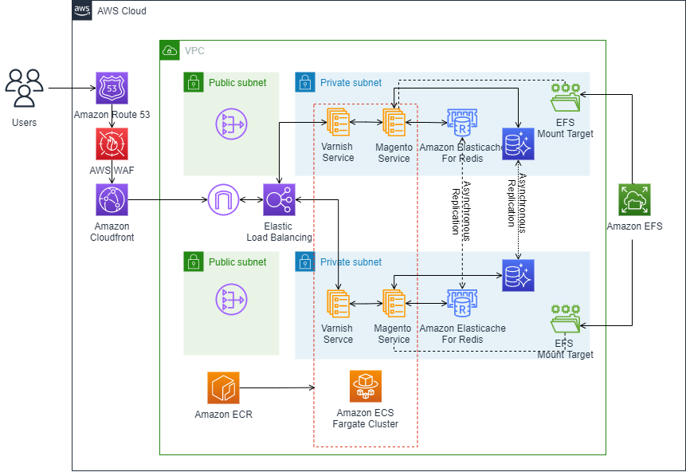

# Magento deployment on AWS using ECS/Fargate, RDS, OpenSearch, and EFS deployed with CDK

The goal of this sample project is to provide infrastructure as code based on AWS CDK in order to run open-source commerce Magento software platform.
Magento is a software platform designed for running commerce workloads.
This sample project will cover how to host a Magento Opensource e-commerce application using AWS Elastic Compute Service and several additional AWS services allowing you to run a produciton-ready well-architected and secure solution.

## Reference architecture

The following diagram shows the high-level architecture



The Magento platform consist of several core and optional components:

- A web server capable of supporting PHP-based applications
- The database server MySQL (we will uses AWS RDS Aurora service)
- ElasticSearch (we will uses AWS OpenSearch to handle this function)
  Optional components for Magento includes:
- A page caching mechanism (we will uses AWS ElastiCache)
- A session storage mechanism (we will uses AWS ElastiCache)
- A shared file system between tasks (the solution propose AWS EFS or AWS Fsx Ontap)

For this implementation, we rely on Magento open-source packaged into a docker containers image by Bitnami's [bitnami-docker-magento](https://github.com/bitnami/bitnami-docker-magento) project

All this architecture is created as code using AWS Cloud Development Kit (CDK) using Typescript flavour, the components are deployed as follows:

- The web application is deployed on AWS ECS container orchestrator using AWS ECS container Orchestration (on Fargate or EC2).
  - An Amazon Route53 Hosted zone must exist and will be configured for the magento subdomain on which the application will be exposed.
  - Magento Service will expose tasks from an AWS Load Balancer, on the specific domain name.
  - Magento Admin Service can be used for administrative tasks thanks to the `ecs exec` features, allowing administrators to securely connect into the admin task.
  - EC2/Fargate can scale up and down thanks to ECS Autoscaling mechanism to adapt your infrastructure with the incoming load on the load balancers.
- The Application Load Balancing forward incoming requests directly to the web application service tasks.
- The database component is hosted in Amazon Aurora MySQL compatible service.
- The Magento search feature is powered by Amazon OpenSearch service (compatible with ElasticSearch)
- In order to accelerate page loads and provide Global access for customers, the application load balancer will be fronted by Amazon CloudFront service, on which we can enable AWS WAF security features to protect the commerce site.
- The TLS communication will be handled by an AWS Certificat Manager certificat.
- AWS Secrets Manager will be used to store severals secrets generated by the CDK (Magento password, databases secrets) and some external secrets that can be necessary (Magento Account credentials)

## The project is Bootstrap with Projen and rely on CDK

### Projen installation

```bash
npm install -g yarn
npx npm i projen -D
```

#### how this project was bootstrap with Projen (just for information):

```bash
$ git init
$ npm init -y
$ npm i projen -D
$ #git defender --setup // activate git defender if required
$ npx projen new awscdk-app-ts
```

The previous command created the `.projenrc.js` project configuration file.

From this file, projen can generate/update our application directory structure:

```bash
npx projen
```

You can create alias to launch projen:

```bash
alias pj='npx projen'
```

then execute `pj` to bootstrap or upgrade your project.

```bash
pj
```

### Project Pre-requisites

You will need to create AWS Secrets for Magento MarketPlace Credentials.

First If you don't already have Adobe Magento accoutm you can create one on https://devdocs.magento.com/guides/v2.3/install-gde/prereq/connect-auth.html

Go to My `Account/Marketplace/Access Keys` and create a New Access Key.

and then you will populate Magento secrets in AWS SecretManager with name : **MAGENTO_MARKETPLACE** and value/pair:

```
| Secret key  | Secret Value                      |
| ----------- | --------------------------------- |
| private-key | **private-key-from-magento-site** |
| public-key  | **public-key-from-magento-site**  |
```

> Be careful the copy button may introduce a space in the credentials, you need to remove it.

### Project Configuration

First of all, you must specify a stack name that would be used to create your stack. This is done with an environment parameter `CDK_STACK_NAME` which defaults to `magento`.

```bash
export CDK_STACK_NAME=magento
```

> **IMPORTANT** Note: $CDK_STACK_NAME is also used to create database name and domain names, so valid characters are `a-z` (lowercase only) and `0-9`

This variable can be exported in your environment before creating the CDK stack.

In the `.projenrc.js` configuration file, you can configure how the stack will be deployed inside your AWS Account.

After updating the **context** section, you will need to run again `pj` in order to generate the appropriate cdk.json file from the Projen bootstrap structure.

```json
...
  context: {
    //vpc_tag_name: 'ecsworkshop-base/BaseVPC', // TAG Name of the VPC to create the cluster into (or 'default' or remove to create new one)
    //enablePrivateLink: 'true',

    //Do you want to back data on share FilsSystem ?
    //Using EFS
    createEFS: 'yes', //CDK will create the EFS File System
    useEFS: 'no', // if true, /bitnami/magento directory will be mapped to a new empty EFS volume.
    //or using FSX ?
    useEFS: 'yes', // if true, /bitnami/magento directory will be mapped to a new empty FSX volume.

    ec2Cluster: 'yes', // if yes, create en EC2 based cluster, if no create Fargate cluster

    //os_domain_endpoint: 'search-magento-zwa5v3x4br3kgn4y5e5nu6hv7q.eu-west-1.es.amazonaws.com', // Use Existing OS domain
    //os_domain: 'magento-cdk', // default to $CDK_STACK_NAME
    os_master_user_name: 'magento-master-os',

    //db_name: 'magento', // default to env $CDK_STACK_NAME
    db_user: 'magentodbuser',

    route53_domain_zone: 'your-hosted-zone.route53.com',
    //route53_magento_prefix: 'magento', // default to $CDK_STACK_NAME
    //route53_eksutils_prefix: 'eksutils', // default to $CDK_STACK_NAME-eksutils

    magento_user: 'user1',
    magento_admin_task: 'yes',
    magento_admin_task_debug: 'no',
  },
  ...
```

- **vpc_tag_name** : You can specify a tag name to use existing VPC, or ommit this parameter to create new VPC from CDK
- **enablePrivateLink** if true, enable VPC service endpoints for Cloudwatch, EFS, SecretManager. (@default: no)
- **createEFS** yes/no. if yes, create an EFS volume (@default: no)
- **useEFS** yes/no. if yes, map /bitnami/magento directory to the EFS created file system (@default: no)
- **useFSX** yes/no. if yes, create an FsX File System and map /bitnami/magento directory to the FSX created file system (@default: no)

  > useFSX and useEFS are mutual exclusive.

- **ec2Cluster**: yes/no. if yes, create an EC2 base cluster with Autoscaling group and Capacity Providers (@default: no = Fargate Cluster)

OpenSearch cluster parameters (password is generated by CDK and stored in SecretManager with name "$CDK_STACK_NAME-magento-opensearch-admin-password"):

- **os_domain_endpoint**: (OPTIONAL) If you have existing OpenSearch server you want to reuse, else create new OpenSearch domain.
- **os_domain** : the name of the OpenSearch Cluster that the cdk stack will create for you (@default: <stack_name>)
- **os_master_user_name**: the name for the master
- TODO: make rise of os_master_user_password

RDS Database (password is generated by CDK and stored in SecretManager with name "$CDK_STACK_NAME-magento"):

- **db_name**: the name of the db to create (@default: $CDK_STACK_NAME)
- **db_user**: the name of the db user (@default: magentouser)

ECS Cluster

- **route53_domain_zone** (MANDATORY) needs to specify the Route53 zone you want to use to deploy your services
- **route53_magento_prefix**: prefix to uses for exposing Magento service (@default: $CDK_STACK_NAME)
- **route53_eksutils_prefix**: prefix to uses for exposing the Eksutils service (@default: $CDK_STACK_NAME-eksutils )

> **You need to have prior to this created a wildcard certificate for your route53 zone in Certificate Manager and store this arn in Parameter store with key `CertificateArn-<route53_domain_zone>`**

Magento (password is generated by CDK and stored in SecretManager with name "<stackname>-magento-database-password"):)

- **magento_user**: magento user (@default: magento)
- **magento_admin_task**: yes/no - start admin magento service used to bootstrap magento with with `MAGENTO_DEPLOY_STATIC_CONTENT=yes`, `MAGENTO_SKIP_REINDEX=no`, `MAGENTO_SKIP_BOOTSTRAP=no` (@default yes)
- **magento_admin_task_debug**: yes/no - start admin magento service with just bash (not running magento instance) for debugging or executing scripts (@default no)

## Generate and deploy

Synthesize and generate the CloudFormation template from the CDK Typescript code:

```bash
make synth
```

Deploy the stack into your AWS account

```bash
make deploy
```

If you don't have `make` you can still directly uses

Example: if you want to build and test the application

```bash
pj build
```

If you want to deploy

```bash
pj deploy
```

The deploy action will apply the CDK generated CloudFormation template to your AWS Account. (Note, the services deployed here will incur costs in your account).

## Install magento demo content

We propose two ways to configure your magento website.

1. Using a build Pipelineallowing to configure the final magento website into a big Docker Image, and then uses this Image in the `docker/Dockerfile.noefs`
2. Using the Admin task, allowing to connect to an empty magento website, and configure it in the running phase.

### Warm up page cache

Caching pages in solution like Magento is really mandatory for production workloads. Everytime a user requess come in, magento PHP code is invoked to generate the page, the page is served to the user, and then the page is stored in cache for next time. In this solution we rely on AWS Elasticache as the caching layer for our generated pages.

This process is fairly time-consuming, also if we take into account that the php code maybe stored on a shared file system like EFS or FsX Ontap.

With the crawler, you can accelerate this process by letting magento know thants to a special header that the request is all about cache generation and it does not need toserved the page, only to cache it.

Additionaly, you can uses the crawler to refresh expired pages at regular intervals, so that the changes that a user will encounter an uncached page is significantly diminished, and makes your site faster.

#### Generate a Sitemap

The crawler will needs to know what page your site offer, so we will generate a Sitemap using Magento2 built-in module:

Magento 2 has a builtin module for generating a sitemap and it’s fast.
Navigate to Magento Admin > Stores > Settings > Configuration > Catalog > XML Sitemap
Set Generation Settings > Enabled to Yes
Navigate to Magento Admin > Marketing > Seo & Search > Sitemap
Click the Add Sitemap button.
Set Filename = sitemap.xml and Path = /
Click the Save & Generate button
A sitemap.xml file will be generated in your Magento 2 document root.

#### Uses the LiteSpeed cache crawler script

Here we rely on LiteSpeed crawler script for Magento. You can [download](https://www.litespeedtech.com/packages/litemage2.0/M2-crawler.sh) it here and execute from the place of your choice:

```
bash M2-crawler.sh https://www.example.com/sitemap.xml
```

### Using a build Pipeline

You can create a whole docker image containing all the modules and data for your site and then providing this image to run. By default, this repository build images in the `docker` directory, and you can replace this with your custom build.
Depending on your needs you may or not need a shared file system with this custom setup and would like to activate or deactivate tje `useEFS` or `useFSX` deployment flags.

### Using the Admin Task

If you want to install specific Magento content, you can use the magentAdmin service to exec into.
Use the Cdk output (or CloudFormation output in console) to get the connect command:exemple : `ecs_exec_service magento MagentoServiceAdmin magento`

This will create a secure shell (The session is encrypted with a dedicated AWS KMS key generated for you by CDK) within your tasks, and all your commands will be stored in a dedicated CloudWatch log group (/ecs/secu/exec/${CDK_STACK_NAME})

Below are example script that can be used to install Magento sample data (https://github.com/magento/magento2-sample-data): `/install_sample_datas.sh`

Connect to the Admin task and execute the script:

```
$ ecs_exec_service magento MagentoServiceAdmin magento
root@ip-10-0-137-105:/# /install_sample_datas.sh
```

To test the service is working you can now connect to the service Task

```bash
$ ecs_exec_service magento MagentoService magento
root@ip-10-0-145-190:/# curl -H "Host: $MAGENTO_HOST" localhost:8080

```

## TroubleShoot and debug

### Connect to the Magento Admin Task

If you activate the context parameter `magento_admin_task` then the Stack creates a dedicated Service that is deployed with all same parameters as the Magento task, except that it don't get exposed through a load balancer, But is linked with the same, DB, same Opensearch, and the same Elastic Fils system or FsX ONTAP...
If you activate the context parameter `magento_admin_task` then, the Admin task actually do nothing, letting you to exec into it and configure manually magento as you need.

> You can use the Admin task to interact with your Magento setup or debug things.
> The CDK stack correctly configures the tasks so that you can securely connect inside.

The CloudFomation Output shows you some commands so that you can directly use to exec inside your tasks.
the Makefile can also show you these commands:

```bash
make connect
```

The printed commands can be used to exec into your containers. It uses a helper function that you can put in your PATH or simply source the file:

```bash
source src/helper.sh
ecs_exec_service magento MagentoServiceDebug magento
```

> In case of errors during the connection, you still can use [ecs-exec-checker](https://github.com/aws-containers/amazon-ecs-exec-checker) tool to figure out where the problem is.

### Troubleshoot first install

The bootstrapping of Magento is done with 2 steps:

1. The MagentoServiceAdmin tasks needs to do the bootstrap, and execute the `docker-entrypoint-init.d/01-install-sample-data.sh` script.
   1. when finished it will create a specific file `/bitnami/magento/__INIT_IS_OK__` on the shared file system (EFS or FsX)
2. The MagentoService tasks will not boot until the specific file exists
   1. Once the file exists, magento will start on MagentoService tasks.

When Magento starts, it will execute the following command this must be done using the `daemon` user.:

```bash
su daemon -s /bin/bash
/opt/bitnami/scripts/magento/entrypoint.sh /opt/bitnami/scripts/magento/run.sh
```

If the Task didn't start properly, you can exec into the MagentoServiceAdmin task and manually execute the previous command to help figure out where comes the problem is.

- This can be Magento Marketplace credentials issues
- This can be bad ElasticSearch passwords format :

  ```
  In SearchConfig.php line 81:

    Could not validate a connection to Elasticsearch. Could not parse URI: "htt
    ps://magento-master-os:beavqpdh.Kzm4?6WqtJHv4e0Lj3AioyI@search-magento-zwa5
    v3x4br3kgn4y5e5nu6hv7q.eu-west-1.es.amazonaws.com:443"
  ```

> If there was a bootstrap error and the specific file `/bitnami/magento/__INIT_IS_OK__` was created, you may need to manually delete it so the bootstrap process can try again.

### Debug Magento Apache configuration

Check Magento config:

```
php bin/magento config:show
```

Configuration files are :

```
# /opt/bitnami/apache/conf/httpd.conf
# /opt/bitnami/apache/conf/extra/httpd-default.conf
# /opt/bitnami/apache/conf/vhosts/*.conf
# /opt/bitnami/apache/conf/bitnami/bitnami.conf
# /opt/bitnami/apache/conf/bitnami/php.conf
# /opt/bitnami/magento/app/etc/env.php
```

### Magento Erros logs

If you get an error in magento, you can find corresponding log in

```
/bitnami/magento/var/report/<error_id>
```

If the error is like

```
{"0":"Unable to retrieve deployment version of static files from the file system."
...
```

Generally a solution for that is to rebuild some commands:

Connect to MagentoServiceAdmin Task, and execute the following commands in it

```
ecs_exec_service magento72 MagentoServiceAdmin magento
root@ip-10-0-155-249:/# su daemon -s /bin/bash
root@ip-10-0-155-249:/# cd /bitnami/magento
root@ip-10-0-155-249:/# php -d memory_limit=-1 bin/magento setup:upgrade
root@ip-10-0-155-249:/# php -d memory_limit=-1 bin/magento setup:upgrade
root@ip-10-0-155-249:/# php -d memory_limit=-1 bin/magento cache:flush
```

You may also need to rebuild your cache with the crawler.

### Mysql

You can connect to the Mysql DB from magento asks:

```
mysql -h $MAGENTO_DATABASE_HOST -u $MAGENTO_DATABASE_USER -p$MAGENTO_DATABASE_PASSWORD $MAGENTO_DATABASE_NAME
```

## Elasticsearch

You can test the OpenSearch connection with curl:

```
curl -XPOST -u "$MAGENTO_ELASTICSEARCH_USER:$MAGENTO_ELASTICSEARCH_PASSWORD" "https://$ELASTICSEARCH_HOST/_search" -H "content-type:application/json" -d'
{
"query": {
"match_all": {}
}
}'
```

### Deleting the Stack

The stack is configured to delete the database cluster and OpenSearch cluster, and EFS file system. If you want to be able to keep the data, you will need to update the **removalPolicy** policies of those services in the CDK code.

```typescript
    const db = new DatabaseCluster(this, 'ServerlessWordpressAuroraCluster', {
      engine: DatabaseClusterEngine.AURORA_MYSQL,
      credentials: Credentials.fromPassword(DB_USER, secret),
      removalPolicy: RemovalPolicy.DESTROY, // <-- you can change this -->
      instanceProps: {
        vpc: vpc,
        securityGroups: [rdsSG],
      },
      defaultDatabaseName: DB_NAME,
    });
    ...

    const osDomain = new opensearch.Domain(this, 'Domain', {
      version: opensearch.EngineVersion.OPENSEARCH_1_0,
      domainName: OS_DOMAIN,
      //accessPolicies: [osPolicy], // Default No access policies
      removalPolicy: RemovalPolicy.DESTROY, // <-- you can change this -->
      securityGroups: [openSearchSG],
    ...

    const efsFileSystem = new FileSystem(this, 'FileSystem', {
      vpc,
      securityGroup: efsFileSystemSecurityGroup,
      performanceMode: PerformanceMode.GENERAL_PURPOSE,
      lifecyclePolicy: LifecyclePolicy.AFTER_30_DAYS,
      throughputMode: ThroughputMode.BURSTING,
      encrypted: true,
      removalPolicy: RemovalPolicy.DESTROY,// <-- you can change this -->
    });
```

While we can't delete an ECS Capacity Provider when associated Autoscaling Group still exists, the first attempt to delete the stack may be finished in a `DELETE_FAILED` state. A second delete attempt should properly delete everything.
